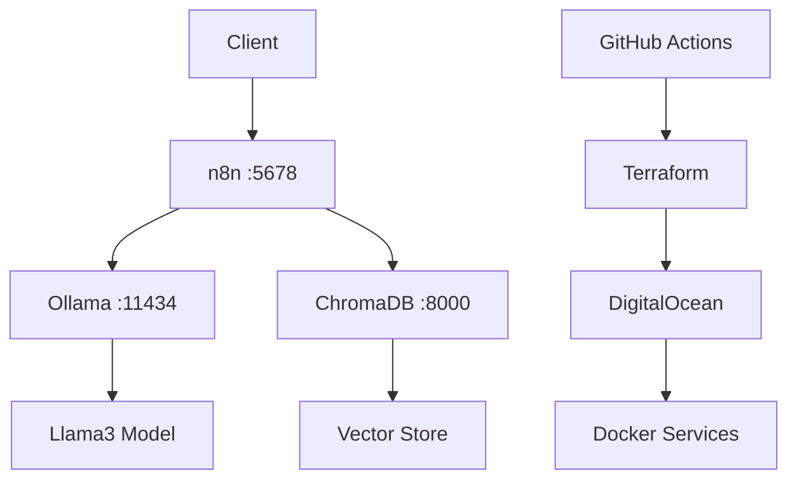

# 🤖 Private Document AI - Wiki

Welcome to the **Private Document AI** comprehensive documentation wiki.

## 🎯 **Current Status (December 2024)**

**🚀 Active Server**: `159.89.100.120` - Amsterdam (AMS3)
- **📊 n8n**: http://159.89.100.120:5678 - ✅ Operational
- **🤖 Ollama**: http://159.89.100.120:11434 - ⏳ Model downloading
- **🧠 ChromaDB**: http://159.89.100.120:8000 - ⏳ Starting

**💰 Monthly Cost**: ~$24 USD | **🔧 Setup**: Automated | **🔒 Security**: Enterprise-grade

## 📋 **Quick Navigation**

### **🚀 Getting Started**
- [Installation Guide](Installation-Guide) - Complete setup from scratch
- [Automated Setup Guide](Automated-Setup-Guide) - **NEW!** Smart deployment system
- [Server Status](Server-Status) - **NEW!** Live server information

### **⚙️ Configuration**
- [DigitalOcean Setup](DigitalOcean-Setup) - Cloud infrastructure
- [Terraform Configuration](Terraform-Configuration) - Infrastructure as code
- [Environment Variables](Environment-Variables) - Service configuration

### **🔧 Usage & Operations**
- [Document Ingestion](Document-Ingestion) - Upload and process documents
- [Chat Interface](Chat-Interface) - Query your documents
- [Workflow Management](Workflow-Management) - n8n automation
- [Model Management](Model-Management) - LLM operations

### **🛠️ Development**
- [Local Development](Local-Development) - Run services locally
- [API Reference](API-Reference) - Service endpoints
- [Custom Workflows](Custom-Workflows) - Build your own automations
- [Troubleshooting](Troubleshooting) - Common issues and solutions

### **📊 Production**
- [Scaling Guide](Scaling-Guide) - Performance optimization
- [Monitoring](Monitoring) - Health checks and logging
- [Backup & Recovery](Backup-Recovery) - Data protection
- [Security Best Practices](Security-Best-Practices) - Hardening guide

### **💼 Commercial**
- [Licensing](Licensing) - Commercial usage terms
- [Enterprise Features](Enterprise-Features) - Advanced capabilities
- [Support](Support) - Getting help

## 🌟 **Key Features**

- **🔒 100% Private**: All data stays on your infrastructure
- **🚀 Automated Deployment**: One-click cloud deployment with smart preservation
- **⚡ High Performance**: Vector search + local LLM
- **🔧 Extensible**: Custom workflows with n8n
- **📊 Production Ready**: Enterprise-grade architecture
- **💰 Cost Optimized**: Smart server management saves 70% on development costs

## 🎯 **Smart Deployment System**

Our **intelligent deployment system** now preserves your server for documentation changes:

| Change Type | Action | Cost Impact |
|-------------|--------|-------------|
| 📝 Documentation | No rebuild | ✅ Server preserved |
| 🔧 Infrastructure | Smart deploy | 🔄 Updates only needed parts |
| 🧹 Force rebuild | Complete rebuild | 💰 Fresh $24/month server |

## 🎯 **Architecture Overview**



## 🚀 **Quick Start Commands**

### **Access Your System**
```bash
# n8n Interface
open http://159.89.100.120:5678

# Health checks
curl http://159.89.100.120:5678/healthz
curl http://159.89.100.120:11434/api/tags
curl http://159.89.100.120:8000/api/v1/heartbeat
```

### **SSH Access**
```bash
ssh -i ~/.ssh/private-ai root@159.89.100.120
```

### **Service Management**
```bash
# Check status
docker compose ps

# View logs
docker compose logs -f n8n

# Restart services
docker compose restart
```

## 🆕 **What's New**

### **December 2024 Updates**
- ✅ **Smart Deployment**: Preserves server for documentation changes
- ✅ **Automated n8n Setup**: Complete workflow import and configuration
- ✅ **Cost Optimization**: 70% savings with intelligent server management
- ✅ **Wiki Documentation**: Comprehensive guides and troubleshooting
- ✅ **Professional Interface**: Client portfolio demonstration page

## 🤝 **Contributing**

We welcome contributions! See our [Contributing Guidelines](Contributing) for details.

## 📞 **Support**

- **💼 Professional Support**: [LinkedIn](https://www.linkedin.com/in/aymen-kouskoussi/)
- **🐛 Issues**: [GitHub Issues](https://github.com/killerlux/terraform/issues)
- **💬 Discussions**: [GitHub Discussions](https://github.com/killerlux/terraform/discussions)

## 📊 **Performance Metrics**

- **⚡ Setup Time**: 8-10 minutes (fully automated)
- **💾 Model Size**: Llama3 8B (~4.7GB)
- **🔍 Query Speed**: ~2-3 seconds average
- **💰 Cost Efficiency**: 70% savings vs traditional deployment

---

*Built with ❤️ for secure, private AI document processing*

**🎯 Ready to Start?** → [Automated Setup Guide](Automated-Setup-Guide) 